# Enabling Third-Party Authentication

## Overview

This script takes you through implementing **Third-Party authentication** to the API which you have already enabled for First-Party authentication.

First Party Authentication means that we will only grant access to the authenticated parts of the API to a SPWA which has been **served from the same domain as the API**. In this case, that means the **SwaggerUI** you developed in the last script.

Due to Cross-Origin restrictions, the browser **won't support the use of SPWAs served from other domains** (such as GitHub Pages) . 

To do that, we need to enable some things on the Auth0 account, and we need to add some authentication smarts to the SPWA.

In this case, the SPWA we'll be upgrading is **[WildLogging](https://github.com/aliceliveprojects/WildLoggingAndAdmin/releases/tag/v.1.0)**. 

We will add:

* An Admin landing page, which handles login and logout
* A Things page, which handles listing and deleting of Things
* An Events page, which handles listing and deleting of Events

> However, since this guide is about setting up third-party authentication, we won't have you add the pages above. We will be adding code to a release of the **WildLogging SPWA** where these pages have already been implemented.

First though, the Account.

In the previous script we defined an application in the Auth0 account (SwaggerUI) and gave it access to our API. Because we *own* the application, and it's served from our domain, we're happy that it's safe.

In the case of the WildLogging application; that's served to us from GitHub Pages; a different domain. It's untrusted.

You'll find that all API providers, Google, Twitter, Facebook etc. require the Developer of an SPWA to register it, and get a client ID, before they are allowed to access their API.

Once the developer has deployed that SPWA, a user of it must consent to it using the API to access their data.

This is exactly what we will be facilitating by making the API available to third-parties:

1. The developer will register their SPWA with the owner of the API (Urban Wild, on Auth0)
   1. They get a client ID
2. The developer writes the application to access the API on the user's behalf 
   1. The application will present the user with a login process
      1. It gets an access token using Auth0 and the client ID
      2. The application will access the user's data
3. The  developer deploys the app
   1. To GitHub Pages - a different domain to the API and the Authentication
4. The user uses the App to access the service:
   1. They attempt to login
   2. Auth0 handles the login
      1. Asks the user to give consent for the app to access their data
      2. Allows them to login and connect the app with their data
5. Notice that 'consent' means that the user is allowing the app to access their important data, on their behalf. 
   1. **They had better be very sure they know this app is safe**
   2. This is the reason for certification (trust certificates) on the browser address bar.

## Your own SPWA repo

Log into GitHub and create a repository.

We've called ours **WildLoggingAndAdmin**.

Tick the box shown below to initialise the repo with a README when you create it :

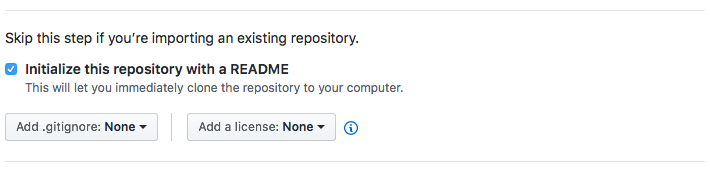

Clone the repo you created using GitHub Desktop.

## Auth0 Third Party Authentication

When you set up your account with Auth0, you're given the ability to add applications and APIs to a Tenant. 

> In this case, the **Tenant** is the same as our organisation: Urban Wild.
>
> **Tenant is a good word: essentially our group of authenticated things called 'Urban Wild' rents space on Auth0's infrastructure.**

### Set Auth0 to Allow Dynamic Application Registration

This is the first stage in the process of making the API accessible to third-party developers.

The Urban Wild tenant has some settings which are important. You can find them by logging into your Auth0 account's dashboard, and going into your account profile.

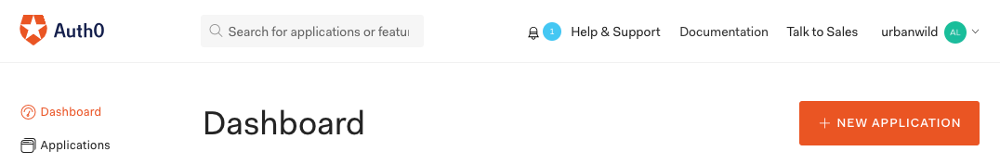

tap on the profile button:

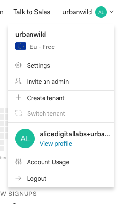

Choose 'Settings'

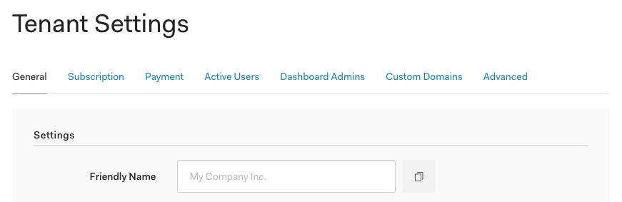

Click on the 'Advanced' tab and scroll down to the 'Settings' section

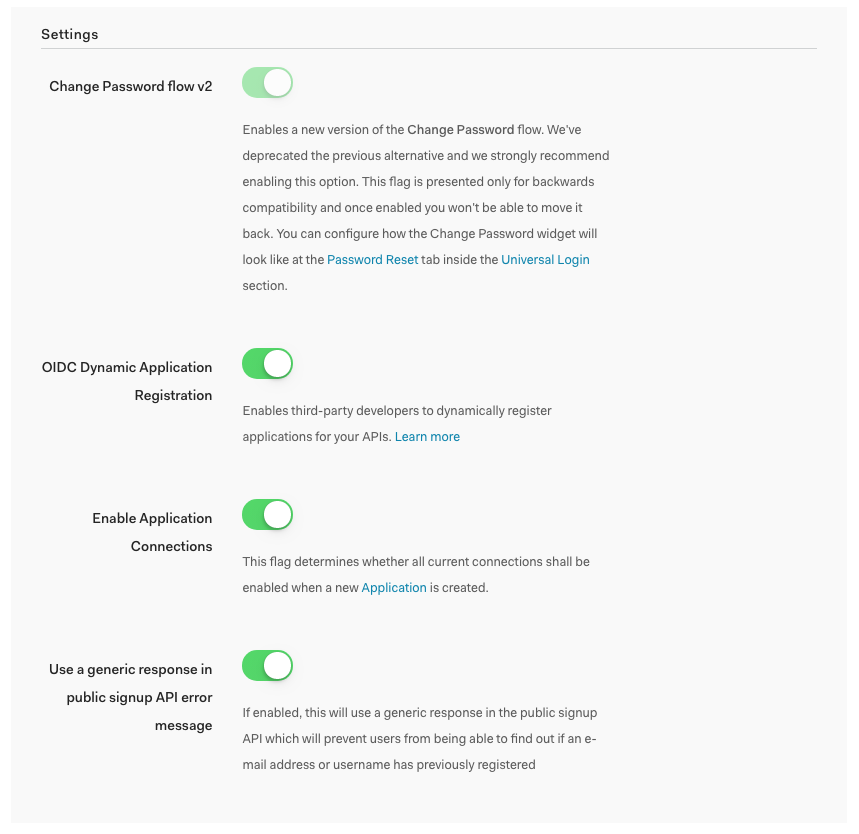

Enable OIDC Dynamic Application Registration

### Add a third party application to the tenant

Enabling the OIDC Dynamic Application Registration will allow us to add a third party application to our tenant using cURL. Copy and paste the following into a text editor and substitute your data into the marked areas ( <> )  :

```bash
curl --request POST \
--url 'https://<YOUR_TENANT_DOMAIN>/oidc/register' \
--header 'content-type: application/json' \
--data '{"client_name":"<NAME_YOUR_THIRD_PARTY_APPLICATION>","redirect_uris": ["https://<YOUR_GITHUB_USERNAME>.github.io/<NAME_OF_YOUR_SPWA_REPO>/admin/auth", "http://localhost:5500/#/admin/auth"]}'
```

> Note that <NAME_OF_SPWA> is the name of the repo that you created.

Then paste your modified cURL request into the terminal and hit enter.

> What should come back:

```json
{
  "client_name":"<THE_NAME_YOU_GAVE_TO_YOUR_THIRD_PARTY_APP>",
  "client_id":"<YOUR_THIRD_PARTY_APP'S_CLIENT_ID>",
  "client_secret":"LALALALALALALALALAIMNOTTELLING",
  "redirect_uris":[
    "https://<YOUR_GITHUB_USERNAME>.github.io/<NAME_OF_YOUR_SPWA_REPO>/admin/auth",
    "http://localhost:5500/#/admin/auth"
  ],
  "client_secret_expires_at":0
}
```

> (It will come back in the terminal as one long JSON string instead of a structured one like you see above)
>
> Paste it into [here](http://jsonviewer.stack.hu/) to see it formatted.

You should see the following in the applications page on the Auth0 website :


> Note : It will have the name sent in the cURL request (client_name parameter).

### Change signing algorithm

By default, a third party app's signing algorithm is HS256 but we want RS256 so that we can authenticate using the RSA endpoint.

To change this, find the third party application in the Applications page on the Auth0 website and scr oll down until you see a **Show Advanced Settings** button (just above the **Save Changes** button) like in the following image :

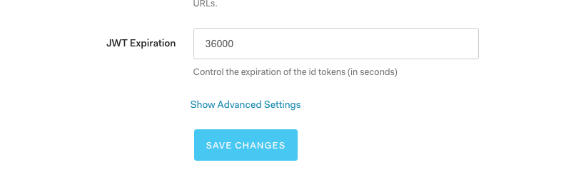

Once you've clicked on it, go to the OAuth tab and change the **JsonWebToken Signature Algorithm** field to **RS256** like in the following image :

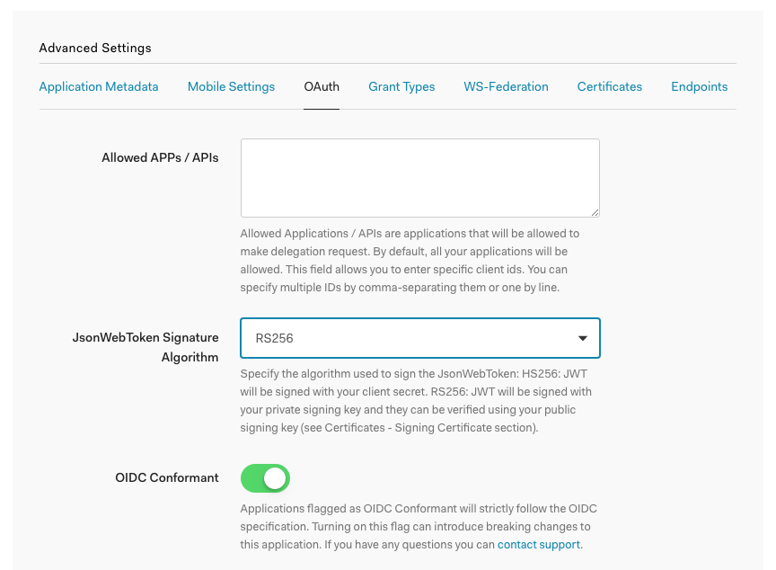

Now our JSON Web Tokens (JWTs) will be signed with the algorithm that we expect it to be signed with.

### Set up Tenant Level Connections

To complete enabling of third party applications we need to **promote** the connections our third party app will use to **domain-level connections**.

To do this we will need to use the [Management API](https://auth0.com/docs/api/management/v2#!/Connections/get_connections). **However** ... the management API needs the API token of the **Auth0 Management API**, which is a **System API** that is created when you create a tenant, in your dashboard under the section called **APIS**. You can get this token by using an API explorer [here](https://manage.auth0.com/#/apis/management/explorer). Once you have copied the API token. Go back to the [Management API](https://auth0.com/docs/api/management/v2#!/Connections/get_connections) and do the following :

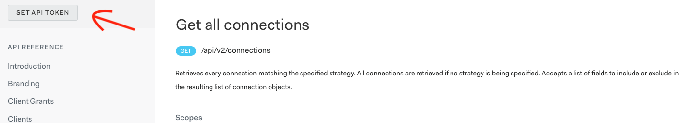

Click on the **SET API TOKEN** button.

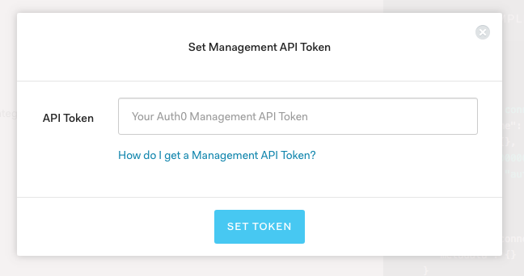

Paste the API token you copied into the box and click the **SET TOKEN** button.

#### Promoting the connection

Once the Management API SPWA provided by Auth0 has your API token, it can make requests to your **Auth0 Management API** (which you can find in the APIs section of your Auth0 dashboard) that will get the **Connections** in your **Tenant** and will allow you to promote them.

Firstly you need to get the **Username-Password-Authentication** Database Connection's connection ID. You can do this by sending a **GET** request to fetch details about the **Connections** in your **Tenant** :

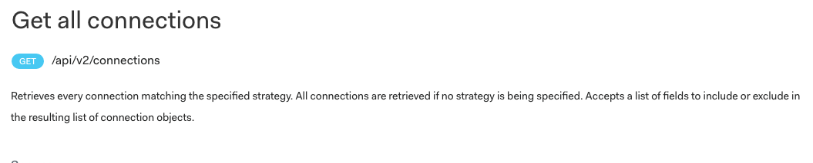

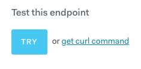

Then press the **TRY** button

That should return something like the following :

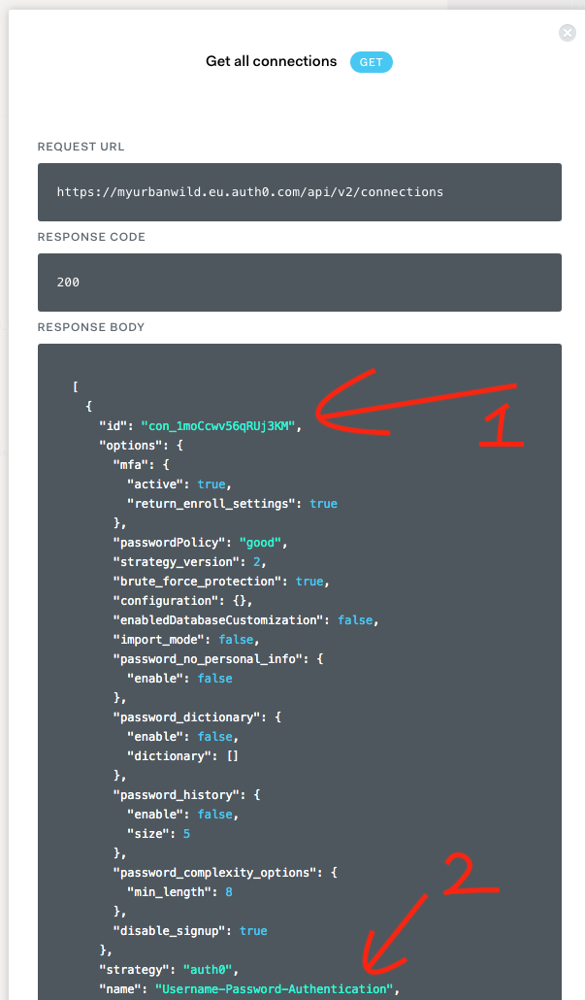

1. The connection ID
2. Of the **Username-Password-Authentication** Database Connection

Copy the connection ID and use it to send a **PATCH** request to the **Username-Password-Authentication** connection. The request will look like the following :

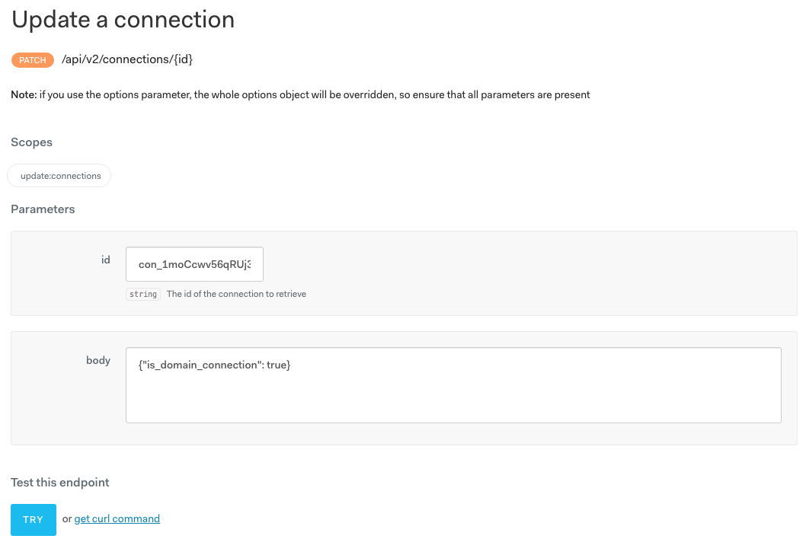

> If you can't find this endpoint replace the document fragment (#something) at the end of the URL in the Management API SPWA with this one : `#!/Connections/patch_connections_by_id`

Paste the connection ID of **Username-Password-Authentication** into the id field and add `{"is_domain_connection":true}` to the body field.

Then press the **TRY** button.

The response should look something like the following:

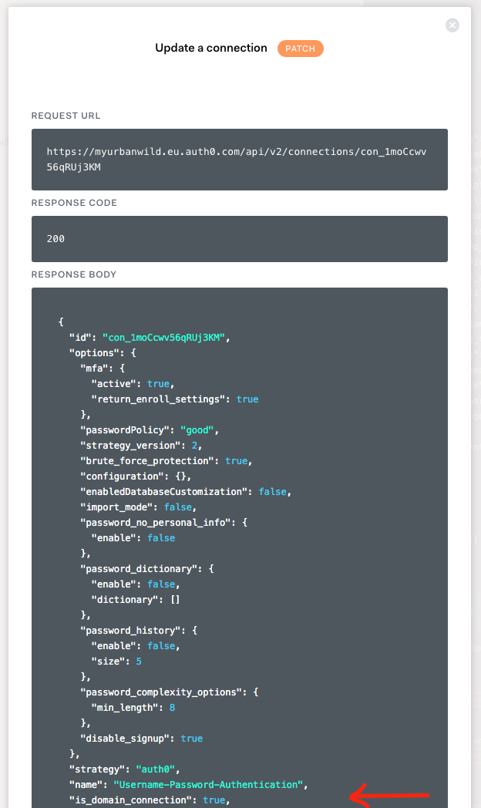

If the `"is_domain_connection"` field is set to `true` then **SUCCESS!**. We have successfully promoted our database connection. :)

### Allowed Web Origins

We now want to set up **Allowed Web Origins** as it is needed for [Silent Authentication](https://auth0.com/docs/api-auth/tutorials/silent-authentication) (which renews tokens) to work properly.

The application needs to specify the web origins (domains) that it will be served from. Once again we will use the [Management API](https://auth0.com/docs/api/management/v2#!/Clients/patch_clients_by_id) to do this. Go to the management API and give it your Auth0 Management API's token as shown earlier.

You should automatically be on the `Update A Client` endpoint after clicking on the link and giving it the token. If you are, give it the Client ID of your third party application. Before you make the request, paste the following into the `body` field after replacing the placeholders with the values for your client/github :

```json
{
  "web_origins": [
    "https://<YOUR_GITHUB_USERNAME>.github.io",
    "http://localhost:5500"
  ]
}
```

> NOTE: You should make sure that the port after `localhost` matches the port that the SPWA is served on locally.

#### Why is this needed?

Auth0 says that Third Party apps must contact the tenant in order to make changes to its settings. This is good because it requires that the developer of the third party app will have to contact the developer who owns the tenant (both of these people are you whilst following this guide).

##### The Alternative

The alternative option is to not implement [Silent Authentication](https://auth0.com/docs/api-auth/tutorials/silent-authentication) and instead, force the user to login every time. This can be achieved by logging the user out of their Auth0 session every time they log out, or come back to the application after closing it without logging out. The effect of doing this is as follows :

* Whenever the user logs out and then tries to log back in, they will have to enter their username and password.
* Whenever the user closes the tab, without logging out, the next time they go to the SPWA, they will have to log in again by entering their username and password.

##### How to implement the alternative

The steps to take require some modifications to your third party application's settings on the Auth0 dashboard as well as some changes to the code you will be writing later on. For now, if you want to implement the alternative, follow the outlined steps below instead of adding Allowed Web Origins to everything else. if you don't want to implement the alternative, [skip the following steps](https://github.com/aliceliveprojects/WildLoggingDBParent/blob/master/ThirdPartyAuthentication.md#creating-a-user-and-giving-them-scopes).

#####  Undo what you just set up

Remove the Allowed Web Origins that you setup as you will not be using them. Go to the Auth0 dashboard, find your third party application, and clear out the Allowed Web Origins.

##### Tell Auth0 what your logout URLs are

After you have removed the Allowed Web Origins, add your logout url for localhost and github pages. They should look like the following (substitute your data in where necessary) :

```
https:/<YOUR_GITHUB_USERNAME>.github.io/<NAME_OF_YOUR_SPWA_REPO>/,
http://localhost:5500
```

That's it for the things you need to do to on the Auth0 dashboard in order to remove silent authentication and force the user to log in all the time. The rest of the things you need to do, pertain to the actual code that you will be writing as you follow this how-to/guide. You do not need to know what these pieces of code are just yet, but rest assured that you will be very clearly informed later on in the guide about what code you need to change and where you need to change it.

### Creating a user and giving them scopes

When we test our SPWA, we are going to need a test user to login with. This user will be given the `admin` scope and will act as an administrator for our SPWA who can go to the SPWA, login (because they were given admin scope) and perform DELETE and PUT requests to our API.

Before you create the user, make sure that you have setup [Hooks](https://github.com/aliceliveprojects/WildLoggingDBParent/blob/master/Authentication.md#adding-hooks) and [Rules](https://github.com/aliceliveprojects/WildLoggingDBParent/blob/master/Authentication.md#adding-rules) from the [previous guide](https://github.com/aliceliveprojects/WildLoggingDBParent/blob/master/Authentication.md).

By following the previous guide, you should have already created a user when you initially signed up to the API, before disabling Sign Up in the Auth0 dashboard.

If you have already created a user, **check** that they have an **`allocated_scopes` property** as shown below.

> **If they don't, delete that user and create them again or just create a new user altogether**.

What is important, is that a user is created because the **Hook** that we setup in the previous guide, is **executed on pre-registration**, and we want that **Hook** to execute and give the user we create an `allocated_scopes` property on their `app_metadata`.

**Once done, you should see the following in the user's details section :**

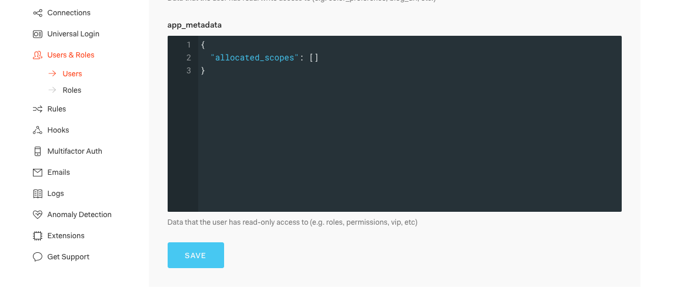

> The `allocated_scopes` property should be an empty array

**Now we are going to give the user you created, the `admin` scope.**

We are going to do this through a PATCH request to the [Management API](https://auth0.com/docs/api/management/v2#!/Users/patch_users_by_id). This is the same as before because you need to get the API token of your **Auth0 Management API** and give it to the SPWA that Auth0 provides to make all kinds of requests that will do all kinds of things, including updating a user's `app_metadata`.

First we need to get the user's ID. To do this we need to go to [here](https://auth0.com/docs/api/management/v2#!/Users/get_users) and make a request to get all the users on our tenant :

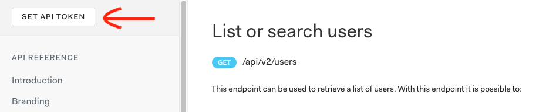

> Make sure to set the API token (which you can get from [here](https://manage.auth0.com/#/apis/management/explorer))

Once you have set the API token and made the request, you need to find the user in the response and copy their ID :


Once you have the `user_id`, you need to go to the Update a user endpoint on the same page either by finding it on the list of endpoints in the navigation pane to the left of the SPWA or by replacing the document fragment (bit after the # at the end of a URL) in the URL with `!/Users/patch_users_by_id`.

> If you've found the right endpoint, the url should look like this :
>
> `https://auth0.com/docs/api/management/v2#!/Users/patch_users_by_id`

Once you've got to the endpoint, paste in the `user_id` and the following in the `body` field :

```json
{
  "app_metadata": {
    "allocated_scopes": [
      "admin"
    ]
  }
}
```

Then press the **TRY** button. The `allocated_scopes` property in the response that comes back should have the `"admin"` scope in it now. If it's there then **SUCCESS!!**.

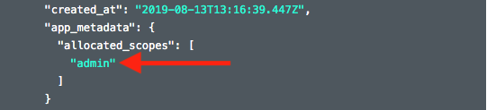

### Making a small change to the Hosted Login Page

Go to the following URL after substituting your tenant name into it :

> manage.auth0.com/dashboard/eu/<YOUR_TENANT_NAME>/login_page

You should see the following page:

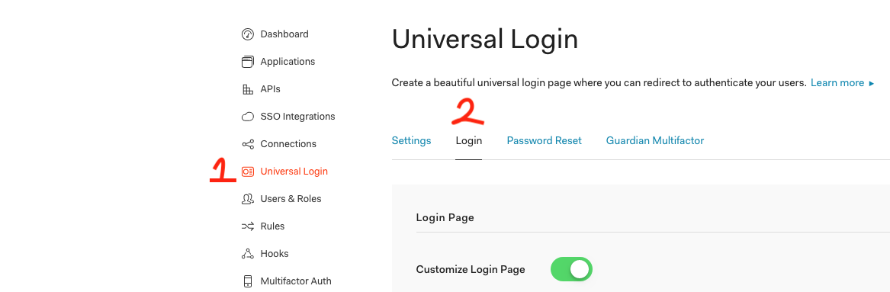

>If you don't see the above page then go to your Auth0 dashboard and click on Universal Login (1) and then click on the Login tab (2)

Once you are on this page, toggle the **Customize Login Page** button so that it is enabled as shown in the picture above. If it is already enabled then that is okay as well. After enabling that button you should be able to edit the html below it. The dropdown just above the HTML should say **Default Templates**. If not change it to **Default Templates** and then copy and paste the following code into the editor window :

```html
<!DOCTYPE html>
<html>
<head>
  <meta charset="utf-8">
  <meta http-equiv="X-UA-Compatible" content="IE=edge,chrome=1">
  <title>Sign In with Auth0</title>
  <meta name="viewport" content="width=device-width, initial-scale=1.0" />
</head>
<body>

  <!--[if IE 8]>
  <script src="//cdnjs.cloudflare.com/ajax/libs/ie8/0.2.5/ie8.js"></script>
  <![endif]-->

  <!--[if lte IE 9]>
  <script src="https://cdn.auth0.com/js/base64.js"></script>
  <script src="https://cdn.auth0.com/js/es5-shim.min.js"></script>
  <![endif]-->

  <script src="https://cdn.auth0.com/js/lock/11.17/lock.min.js"></script>
  <script>
    // Decode utf8 characters properly
    var config = JSON.parse(decodeURIComponent(escape(window.atob('@@config@@'))));
    config.extraParams = config.extraParams || {};
    var connection = config.connection;
    var prompt = config.prompt;
    var languageDictionary;
    var language;

    if (config.dict && config.dict.signin && config.dict.signin.title) {
      languageDictionary = { title: config.dict.signin.title };
    } else if (typeof config.dict === 'string') {
      language = config.dict;
    }
    var loginHint = config.extraParams.login_hint;
    var colors = config.colors || {};

    // Available Lock configuration options: https://auth0.com/docs/libraries/lock/v11/configuration
    var lock = new Auth0Lock(config.clientID, config.auth0Domain, {
      auth: {
        redirectUrl: config.callbackURL,
        responseType: (config.internalOptions || {}).response_type ||
          (config.callbackOnLocationHash ? 'token' : 'code'),
        params: config.internalOptions
      },
      /* additional configuration needed for custom domains
      configurationBaseUrl: config.clientConfigurationBaseUrl,
      overrides: {
        __tenant: config.auth0Tenant,
        __token_issuer: 'YOUR_CUSTOM_DOMAIN'
      }, */
      assetsUrl:  config.assetsUrl,
      allowedConnections: connection ? [connection] : null,
      rememberLastLogin: !prompt,
      language: language,
      languageDictionary: languageDictionary,
      theme: {
        //logo:            'YOUR LOGO HERE',
        primaryColor:    colors.primary ? colors.primary : 'green'
      },
      prefill: loginHint ? { email: loginHint, username: loginHint } : null,
      closable: false,
      defaultADUsernameFromEmailPrefix: false,
      __useTenantInfo: config.isThirdPartyClient
      // uncomment if you want small buttons for social providers
      // socialButtonStyle: 'small'
    });

    if(colors.page_background) {
      var css = '.auth0-lock.auth0-lock .auth0-lock-overlay { background: ' +
                  colors.page_background +
                ' }';
      var style = document.createElement('style');

      style.appendChild(document.createTextNode(css));

      document.body.appendChild(style);
    }

    lock.show();
  </script>
</body>
</html>
```

This is the same as the code that was already there except for one line. The new line that was added is shown in the following screenshot (line 64) :


## Adding authentication to the SPWA

Download [this release](https://github.com/aliceliveprojects/WildLoggingAndAdmin/releases/tag/spwa_with_admin_and_login_modules) of the WildLogging SPWA. Once you've unpacked the compressed file, move the contents into the folder that you cloned your repo into and check it in to GitHub.

Open the cloned SPWA folder in VSCode. You should see a directory structure that looks like the following :

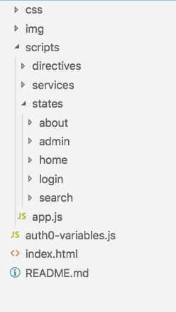

### Running the SPWA locally

To run the SPWA locally it is a good idea to have the Visual Studio Code extension, [live-server](https://marketplace.visualstudio.com/items?itemName=ritwickdey.LiveServer), installed. Once installed we can simply right click on the `index.html` file in the project and serve our **Single Page Web App** (SPWA) from a `localhost` server (running on port 5500 by default).

Once you have run it, you will realize that there are **many errors popping up**. This is _because of some code that is needed to help an AngularJS SPWA function properly_ when served from GitHub Pages. **Commenting out these lines of code will make the SPWA run properly on `localhost`**

The following code snippets show what lines to comment out and which files they are in :

#### index.html

```html
<title>The Urban Wild</title>
<base href="/WildLoggingAndAdmin/"> <!-- Comment out this line -->
<link rel="manifest" href="manifest.json"> <!-- Comment out or delete this line too as we don't have a manifest.json file to link -->
```

> **WHY?** Why does this need to be done? This needs to be done because of the way GitHub Pages **routes to our SPWA**. When a GitHub user/organization create a repository and publishes their master or gh-pages branch, **GitHub creates a subdomain for them using their user/organization name**. For example :
>
> 1. We create a new organization. Let's call it (BobDigitalLabs).
> 2. We then create a repo called CompanySPWA and put our source files for our SPWA in the master branch.
> 3. We go into the repo's settings and publish our site on GitHub Pages.
> 4. GitHub will probably say something like "Your site is published at _bobdigitallabs.github.io/**CompanySPWA**_".
> 5. We create another repo called WildLoggingAndAdminForBob and put our WildLoggingAndAdmin SPWA in there, but this time, with a few personalizations for Bob.
> 6. See step 3.
> 7. GitHub will say something like "Your site is published at _bobdigitallabs.github.io/**WildLoggingAndAdminForBob**_".
>
> This happens because instead of creating a new subdomain for each repo (which would be costly for GitHub to do) GitHub instead creates one subdomain for each organization and **HOSTS EACH REPOSITORY IN IT'S OWN FOLDER** which is why the **part of the URL that differs** in the examples above is **not the domain**, but rather, **the file path at that domain**.
>
> The **`<base>`** tag is **used to attach the path that differentiates each of the repos** owned by an organization or user **to the end of the domain**. Without it **AngularJS replaces the path part** in the URL and **Auth0 doesn't redirect to our callback properly**.

#### app.js

```javascript
$locationProvider.hashPrefix('');

/// Comment out the line below to run the app
// without HTML5 mode (will use hashes in routes)
$locationProvider.html5Mode(true);
```

The following change doesn't need to be made to run the SPWA locally, but it is a _good idea to point our SPWA to a **locally running version of our API** which is pointed at our **local instance of the database**_.

> This way we can inspect the database and API, in case any problems or bugs arise, to help us fix said problems and bugs.

#### api.service.js

Change this :

```javascript
var service = {};

service.baseDbUrl = "https://urbanwilddbapi.herokuapp.com/";
service.corsProxyUrl = "https://cors-anywhere.herokuapp.com/";
```

to this :

```javascript
var service = {};

// service.baseDbUrl = "https://urbanwilddbapi.herokuapp.com/";
service.baseDbUrl = "http://localhost:8080/";
service.corsProxyUrl = "https://cors-anywhere.herokuapp.com/";
```

> There are two services inside of  the `api.service.js` file. We need to change the `service.baseDbUrl` for both of them. In order to do that, once you have made the change described above, change this (further down in the file) : 

```javascript
var service = {};

service.baseDbUrl = "https://urbanwilddbapi.herokuapp.com/";

service.getSightingsByName = function getSightingsByName(sightingsPostcode, pageSize, pageNum) {
```

to this:

```javascript
var service = {};

// service.baseDbUrl = "https://urbanwilddbapi.herokuapp.com/";
service.baseDbUrl = "http://localhost:8080/";

service.getSightingsByName = function getSightingsByName(sightingsPostcode, pageSize, pageNum) {
```

Now if you check your browser, the SPWA should be running and it should look like this :

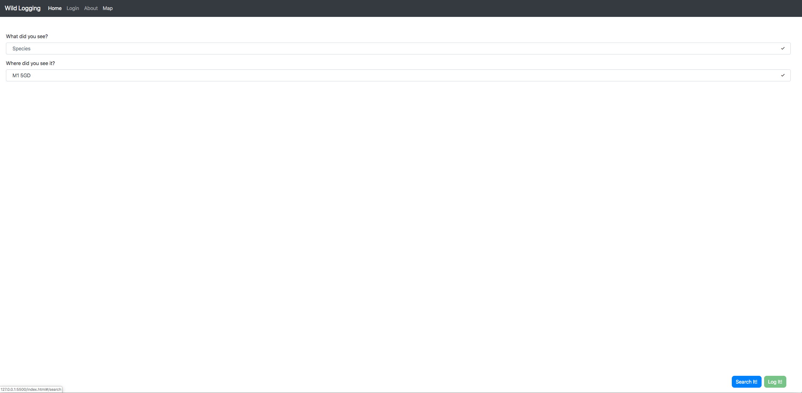

### Setting up to add authentication to the SPWA

We are going to add a new `callback` state to our application. In order to comply with the established directory structure, make a directory called "callback" inside of the folder "state".


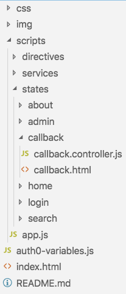


After you have created the folder, add a HTML file and a JavaScript file into the folder and name them as shown in the picture above.

#### callback.controller.js

```javascript
(function () {

  'use strict';

  let app = angular.module('app.callbackState', []);

  app.config(function (
    $stateProvider
  ) {
    $stateProvider.state('callback', {
      url: '/callback',
      templateUrl: 'scripts/states/callback/callback.html',
      controller: 'callbackCtrl as vm',
      cache: false
    });
  })
  
  app.controller('callbackCtrl', callbackCtrl);

  callbackCtrl.$inject = [
    '$state'
  ];

  function callbackCtrl($state) {
    $state.go("admin");
  }

})();
```

> Make sure to link to the `callback.controller.js` file in the `index.html` file.
> **Example** :
> `<script type="text/javascript" src="scripts/states/callback/callback.controller.js"></script>`

This script also creates the `app.callbackState` module and configures the `callback` state within angular as well. So make sure to import the `app.callbackState` module in `app.js` as shown in the following code snippet :

```javascript
const app = angular.module('starter', [
    'auth0.auth0', // <- Whilst we are here, may as well add this.
    'ui.router',
    'ngAnimate',
    'ui.bootstrap',
    'ui-notification',
    'app.homeState',
    'app.searchState',
    'app.aboutState',
    'app.locations',
    'app.api',
    'app.loginState',
    'app.adminState',
    'app.callbackState' // <- Add this to app.js
]);

    app.config(function config(
        $sceDelegateProvider,
        $locationProvider,
        angularAuth0Provider // <- May as well add this too.
    )   {
```

> The extra lines (`'auth0.auth0'` and `'angularAuth0Provider'`) are added for use later.
>
> The `auth0.auth0` line and the `angularAuth0Provider` line basically tells AngularJS that our application depends on the module (`auth0.auth0`) and the provider (`angularAuth0Provider`) given to us by the `angular-auth0.js` library that we have linked in our `index.html` file's `head` element.

#### callback.html

```html
<div class="loading">
  
</div>
```

> You can get the `loading.svg` file from the [final release](https://github.com/aliceliveprojects/WildLoggingAndAdmin/releases/tag/spwa_authentication_supported) of the WildLogging SPWA
>
> **OR** Save just the file on its own from [here](https://raw.githubusercontent.com/aliceliveprojects/WildLoggingAndAdmin/master/img/loading.svg)
>
> **OR** You can create the file locally in the `./img` folder locally and paste the following code into the file :

```html
<?xml version="1.0" encoding="utf-8"?><svg width='120px' height='120px' xmlns="http://www.w3.org/2000/svg" viewBox="0 0 100 100" preserveAspectRatio="xMidYMid" class="uil-ring"><rect x="0" y="0" width="100" height="100" fill="none" class="bk"></rect><defs><filter id="uil-ring-shadow" x="-100%" y="-100%" width="300%" height="300%"><feOffset result="offOut" in="SourceGraphic" dx="0" dy="0"></feOffset><feGaussianBlur result="blurOut" in="offOut" stdDeviation="0"></feGaussianBlur><feBlend in="SourceGraphic" in2="blurOut" mode="normal"></feBlend></filter></defs><path d="M10,50c0,0,0,0.5,0.1,1.4c0,0.5,0.1,1,0.2,1.7c0,0.3,0.1,0.7,0.1,1.1c0.1,0.4,0.1,0.8,0.2,1.2c0.2,0.8,0.3,1.8,0.5,2.8 c0.3,1,0.6,2.1,0.9,3.2c0.3,1.1,0.9,2.3,1.4,3.5c0.5,1.2,1.2,2.4,1.8,3.7c0.3,0.6,0.8,1.2,1.2,1.9c0.4,0.6,0.8,1.3,1.3,1.9 c1,1.2,1.9,2.6,3.1,3.7c2.2,2.5,5,4.7,7.9,6.7c3,2,6.5,3.4,10.1,4.6c3.6,1.1,7.5,1.5,11.2,1.6c4-0.1,7.7-0.6,11.3-1.6 c3.6-1.2,7-2.6,10-4.6c3-2,5.8-4.2,7.9-6.7c1.2-1.2,2.1-2.5,3.1-3.7c0.5-0.6,0.9-1.3,1.3-1.9c0.4-0.6,0.8-1.3,1.2-1.9 c0.6-1.3,1.3-2.5,1.8-3.7c0.5-1.2,1-2.4,1.4-3.5c0.3-1.1,0.6-2.2,0.9-3.2c0.2-1,0.4-1.9,0.5-2.8c0.1-0.4,0.1-0.8,0.2-1.2 c0-0.4,0.1-0.7,0.1-1.1c0.1-0.7,0.1-1.2,0.2-1.7C90,50.5,90,50,90,50s0,0.5,0,1.4c0,0.5,0,1,0,1.7c0,0.3,0,0.7,0,1.1 c0,0.4-0.1,0.8-0.1,1.2c-0.1,0.9-0.2,1.8-0.4,2.8c-0.2,1-0.5,2.1-0.7,3.3c-0.3,1.2-0.8,2.4-1.2,3.7c-0.2,0.7-0.5,1.3-0.8,1.9 c-0.3,0.7-0.6,1.3-0.9,2c-0.3,0.7-0.7,1.3-1.1,2c-0.4,0.7-0.7,1.4-1.2,2c-1,1.3-1.9,2.7-3.1,4c-2.2,2.7-5,5-8.1,7.1 c-0.8,0.5-1.6,1-2.4,1.5c-0.8,0.5-1.7,0.9-2.6,1.3L66,87.7l-1.4,0.5c-0.9,0.3-1.8,0.7-2.8,1c-3.8,1.1-7.9,1.7-11.8,1.8L47,90.8 c-1,0-2-0.2-3-0.3l-1.5-0.2l-0.7-0.1L41.1,90c-1-0.3-1.9-0.5-2.9-0.7c-0.9-0.3-1.9-0.7-2.8-1L34,87.7l-1.3-0.6 c-0.9-0.4-1.8-0.8-2.6-1.3c-0.8-0.5-1.6-1-2.4-1.5c-3.1-2.1-5.9-4.5-8.1-7.1c-1.2-1.2-2.1-2.7-3.1-4c-0.5-0.6-0.8-1.4-1.2-2 c-0.4-0.7-0.8-1.3-1.1-2c-0.3-0.7-0.6-1.3-0.9-2c-0.3-0.7-0.6-1.3-0.8-1.9c-0.4-1.3-0.9-2.5-1.2-3.7c-0.3-1.2-0.5-2.3-0.7-3.3 c-0.2-1-0.3-2-0.4-2.8c-0.1-0.4-0.1-0.8-0.1-1.2c0-0.4,0-0.7,0-1.1c0-0.7,0-1.2,0-1.7C10,50.5,10,50,10,50z" fill="#337ab7" filter="url(#uil-ring-shadow)"><animateTransform attributeName="transform" type="rotate" from="0 50 50" to="360 50 50" repeatCount="indefinite" dur="1s"></animateTransform></path></svg>
```

#### login.html

Replace the `button` element with the following :

```html
<button ng-if="!vm.auth.isAuthenticated()" ng-click="vm.auth.login()" class="btn btn-primary">LOGIN</button>
<button ng-if="vm.auth.isAuthenticated()" ng-click="vm.auth.logout()" class="btn btn-primary">LOGOUT</button>
```

> The `ng-if` and `ng-click`directives need there to be a property called `auth` on the controller object (`vm`), so that it can call the appropriate methods to log the user in or out; as well as display the correct button depending on whether the user is logged in or out.
>
> We should add a reference to the authentication service in our controller function.

#### login.controller.js

```javascript
(function () {

    'use strict';

    var app = angular.module('app.loginState');

    app.controller('loginCtrl', loginCtrl);

    loginCtrl.$inject = [
        'authService'
    ];

    function loginCtrl(
        authService
    ) {

        var vm = angular.extend(this, {});

        vm.auth = authService;

        return vm;

    }

})();
```

> Your login controller logic should look like the logic above once you have finished making the changes.

**Where does this `authService` thing come from??** It doesn't come from anywhere so we have to create it. Here's how . . .

### Creating the Authentication Service

Create a new JavaScript file in the `services` folder. We've called ours `auth.service.js` but you can call it something else if you want to as long as you **link to the script in the index.html file** with the **same name**.

> E.g. `<script type="text/javascript" src="scripts/services/auth.service.js"></script>`

Once the file has been created, paste the following code into the file.

#### auth.service.js

```javascript
(function () {

  'use strict';

  const app = angular.module('starter');

  app.service('authService', authService);

  authService.$inject = ['$state', 'angularAuth0', '$timeout'];

  function authService($state, angularAuth0, $timeout) {

    let service = {};

    let accessToken;
    let idToken;
    let expiresAt;

    service.getIdToken = function getIdToken() {
      return idToken;
    }

    service.getAccessToken = function getAccessToken() {
      return accessToken;
    }

    service.login = function login() {
      angularAuth0.authorize();
    }

    service.handleAuthentication = function handleAuthentication() {
      angularAuth0.parseHash(function (err, authResult) {
        if (authResult && authResult.accessToken && authResult.idToken) {
          service.localLogin(authResult);
          $state.go('callback');
        } else if (err) {
          $timeout(function () {
            $state.go('login');
          });
          console.log(err);
          alert('Error: ' + err.error + '. Check the console for further details.');
        }
      });
    }

    service.localLogin = function localLogin(authResult) {
      // Set isLoggedIn flag in localStorage
      localStorage.setItem('isLoggedIn', 'true');
      // Set the time that the access token will expire at
      expiresAt = (authResult.expiresIn * 1000) + new Date().getTime();
      accessToken = authResult.accessToken;
      idToken = authResult.idToken;
    }

    service.renewTokens = function renewTokens() {
      angularAuth0.checkSession({},
        function(err, result) {
          if (err) {
            console.log(err);
          } else {
            service.localLogin(result);
            $state.go('admin');
          }
        }
      );
    }

    service.logout = function logout() {
      // Remove isLoggedIn flag from localStorage
      localStorage.removeItem('isLoggedIn');
      // Remove tokens and expiry time
      accessToken = '';
      idToken = '';
      expiresAt = 0;
      $state.go('login');
    }

    service.isAuthenticated = function isAuthenticated() {
      // Check whether the current time is past the 
      // access token's expiry time
      return localStorage.getItem('isLoggedIn') === 'true' && new Date().getTime() < expiresAt;
    }

    return service;

  }

})();
```

> If you did not set up **Allowed Web Origins** towards the beginning of this guide, and instead setup **Allowed Logout URLs**, then you need to make a few changes to the above auth.service.js file. If you didn't, [skip the following steps](https://github.com/aliceliveprojects/WildLoggingDBParent/blob/master/ThirdPartyAuthentication.md#configuring-the-authentication-service).

Delete the function called `service.renewTokens` form auth.service.js.

Then replace this piece of code in auth.service.js :

```javascript
service.logout = function logout() {
  // Remove isLoggedIn flag from localStorage
  localStorage.removeItem('isLoggedIn');
  // Remove tokens and expiry time
  accessToken = '';
  idToken = '';
  expiresAt = 0;
}
```

with this when developing on localhost :

```javascript
service.logout = function logout() {
  // Logout of Auth0 removing the session the user had with it.
  angularAuth0.logout({
    returnTo: window.location.origin
  });
  // Remove isLoggedIn flag from localStorage because we have logged out of Auth0.
  localStorage.removeItem('isLoggedIn');
  // Remove tokens and expiry time.
  accessToken = '';
  idToken = '';
  expiresAt = 0;
}
```

and this before checking in the changes :

```javascript
service.logout = function logout() {
  // Logout of Auth0 removing the session the user had with it.
  angularAuth0.logout({
    returnTo: document.getElementsByTagName("base")[0].href
  });
  // Remove isLoggedIn flag from localStorage because we have logged out of Auth0.
  localStorage.removeItem('isLoggedIn');
  // Remove tokens and expiry time.
  accessToken = '';
  idToken = '';
  expiresAt = 0;
}
```

##### Configuring the authentication service

For the service to work properly it needs to be configured. This is done by adding the following into the `app.js` file :

```javascript
angularAuth0Provider.init({
  clientID: CLIENT_CONFIG.AUTH0_CLIENT_ID,
  domain: CLIENT_CONFIG.AUTH0_DOMAIN,
  responseType: 'token id_token',
  redirectUri: CLIENT_CONFIG.AUTH0_CALLBACK_URL,
  scope: CLIENT_CONFIG.AUTH0_REQUESTED_SCOPES,
  audience: CLIENT_CONFIG.AUTH0_AUDIENCE
});
```

> Add the code in the snippet above into the `app.js` file in the `.config()` function after the line `$locationProvider.html5Mode(true);`.

We are also going to add some logic to the `.run()` function in `app.js`. Replace it with the following version :

```javascript
.run(function ($state, $rootScope, $transitions, authService) {

    if (localStorage.getItem('isLoggedIn') === 'true') {
        authService.renewTokens();
    } else {
        // Handle the authentication
        // result in the hash
        authService.handleAuthentication();
    }

    $transitions.onSuccess({}, function () {
        $('.navbar-collapse').collapse('hide');
    });

});
```

> If you did not set up **Allowed Web Origins** towards the beginning of this guide, and instead setup **Allowed Logout URLs**, then you need to make a few changes to the above app.js file's `run` function. If you didn't, skip the following step :

Replace this :

```javascript
if (localStorage.getItem('isLoggedIn') === 'true') {
    authService.renewTokens();
} else {
```

in the app.js file's `run` function with this :

```javascript
if (localStorage.getItem('isLoggedIn') === 'true') {
    authService.logout();
} else {
```

Replace the code in the file called `auth0-variables.js` with the following code :

```javascript
const CLIENT_CONFIG = {
  "AUTH0_CLIENT_ID":"<YOUR_THIRD_PARTY_SPWA_CLIENT_ID_FROM_AUTH0>",
  "AUTH0_DOMAIN":"<YOUR_AUTH0_DOMAIN>",

  "AUTH0_CALLBACK_URL":"https://<YOUR_GITHUB_USERNAME>.github.io/WildLoggingAndAdmin/admin/auth",
  // "AUTH0_CALLBACK_URL":"http://localhost:5500/#/admin/auth",
  
  "APP_SCHEME": "https", 
  // "APP_SCHEME": "http", 

  "APP_DOMAIN": "<YOUR_GITHUB_USERNAME>.github.io", 
  // "APP_DOMAIN": "localhost", 

  "APP_PORT": "443", 
  // "APP_PORT": "5501",

  "AUTH0_AUDIENCE": "<YOUR_AUTH0_API_AUDIENCE>",
  "AUTH0_REQUESTED_SCOPES": "admin" 
};
```

> Remember to substitute in your details in the marked areas ( <> ).

### Handling 404 redirects

Create a `404.html` file in the root directory of the SPWA and paste the following code into it :

```html
<!DOCTYPE html>
<html lang="en">

<head>
  <meta charset="utf-8" />

  <title>404</title>

  <script>
    sessionStorage.redirect = location.href;
  </script>

  <meta http-equiv="refresh" content="0;URL='/WildLoggingAndAdmin'">
</head>

<body>
  &nbsp;&nbsp;&nbsp;&nbsp;&nbsp;&nbsp;&nbsp;&nbsp;&nbsp;&nbsp;&nbsp;&nbsp;&nbsp;
  &nbsp;&nbsp;&nbsp;&nbsp;&nbsp;&nbsp;&nbsp;&nbsp;&nbsp;&nbsp;&nbsp;&nbsp;&nbsp;
  &nbsp;&nbsp;&nbsp;&nbsp;&nbsp;&nbsp;&nbsp;&nbsp;&nbsp;&nbsp;&nbsp;&nbsp;&nbsp;
</body>


</html>
```

> When serving from GitHub pages this `404.html` file will be served when Auth0 redirects after a login, as the callback URL, in `auth0-variables.js`, points to a path that does not exist within our SPWA.
> 
> When the 404 page is served it will store the callback url (which will have the access token returned by Auth0 on it) into the `redirect` property of the `sessionStorage` object (available to access through the `window` object e.g. `window.sessionStorage.redirect = "accessToken=iuo124l981yqly19yquet..."`) and then it will redirect to the root of the SPWA immediately.
> 
> After the redirect happens, the next step in the logic of the authentication service will execute a local login which will save the access token amongst a few other things that Auth0 returns to us after a login.
> 
> Then the SPWA transitions to the `callback` state. The `callback` state then redirects immediately to the `admin` state which is where we want the user to go if they have successfully authenticated.
> 
> The extra step of transitioning to the callback state is to get rid of a `#` at the end of the URL which is leftover from when the authentication service parses the access token.

#### Protecting the access token

The access token returned by Auth0 is needed to successfully make requests to the API. After the SPWA's authentication service has got a hold of it, as well as the other things that are sent back with it, it needs to be **deleted**. This is done in the `index.html` file as we have set our redirect in the `404.html` file to be `0;URL='/WildLoggingAndAdmin/'` which is the base URL of the SPWA.

### index.html

```html
<body>

  <script>
    (function () {
      let redirect = sessionStorage.redirect;
      delete sessionStorage.redirect;
      if (redirect && redirect != location.href) {
        history.replaceState(null, null, redirect);
      }
    })();
  </script>

  <div ng-app="starter" ng-cloak>
    <connectionerror show="vm.errorModalShow">
      modal connection error window
      {{vm.errorModalText}}
    </connectionerror>
  
    <toaster-container></toaster-container>
  
    <nav class="navbar navbar-expand-lg navbar-dark bg-dark">
      <button class="navbar-toggler" type="button" data-toggle="collapse" data-target="#navbarText"
          aria-controls="navbarText" aria-expanded="false" aria-label="Toggle navigation">
        <span class="navbar-toggler-icon"></span>
      </button>
      <a ui-sref-active="active" class="navbar-brand" ui-sref="home">Wild Logging</a>

      <div class="collapse navbar-collapse" id="navbarText">
        <ul ng-controller="appCtrl as vm" class="navbar-nav mr-auto">
          <li class="nav-item">
            <a ui-sref-active="active" class="nav-link" ui-sref="home">Home</a>
          </li>
          <li class="nav-item">
            <a ng-if="vm.auth.isAuthenticated()" ui-sref-active="active" class="nav-link" ui-sref="admin">Admin</a>
          </li>
          <li class="nav-item">
            <a ng-if="!vm.auth.isAuthenticated()" ui-sref-active="active" class="nav-link" ui-sref="login">Login</a>
            <a ng-if="vm.auth.isAuthenticated()" ng-click="vm.auth.logout()" class="nav-link" >Logout</a>
          </li>
          <li class="nav-item">
            <a ui-sref-active="active" class="nav-link" ui-sref="about">About</a>
          </li>
          <li class="nav-item">
            <a ui-sref-active="active" class="nav-link" ui-sref="search">Map</a>
          </li>
        </ul>
      </div>
    </nav>
    <ui-view>
    </ui-view>
  </div>
</body>
```

> Replace your `index.html` file's body element with the one above. We have added a button that takes you directly to the admin state, but only if you have logged in. We have also added buttons to the header that are very similar to the buttons on the login page, where the login and logout buttons are only displayed based on whether the user has logged in or not.

There are also some changes that need to be made to app.js for the changes in index.html to work properly.

### app.js

Add the following code beneath the `.run()` function.

```javascript
.controller('appCtrl', ['authService', function appCtrl(authService) {
  let vm = angular.extend(this, {});
  vm.auth = authService;
  return vm;
}]);
```

> This allows the nav links access to the authentication service, in order to toggle the login and admin links based on whether the user has logged in.

### api.service.js

Add the following lines of code into `api.service.js` :

```javascript
speciesSrvc.$inject = [
    '$q',
    '$timeout',
    '$sce',
    '$http',
    'authService' // <- Add this line for both services in this file
  ];
  function speciesSrvc(
    $q,
    $timeout,
    $sce,
    $http,
    authService  // <- Add this line for both services in this file
  ) {
    var service = {};
```

#### Another change to `api.service.js`

Change `service.baseDbUrl` to point to your locally running API, if you haven't already, as shown in the following code snippet :

```javascript
// Do this for both services in api.service.js
// service.baseDbUrl = "https://urbanwilddbapi.herokuapp.com/";
service.baseDbUrl = "http://localhost:8080/";
```

#### Final change to `api.service.js`

We currently do not pass the access token we get from Auth0 to the API when we make requests to the endpoints that require authentication. To fix this find the following methods and replace them with the examples below:

```javascript
service.deleteSpecies = function deleteSpecies(speciesID) {
  return($http({
    method: "DELETE",
    url: service.baseDbUrl + "things/" + speciesID,
    headers: {
      "Content-Type": "application/json",
      "Authorization": "Bearer " + authService.getAccessToken()
    }
  }));
}
```

```javascript
service.deleteSightings = function deleteSightings(sightingsID) {
  return($http({
    method: "DELETE",
    url: service.baseDbUrl + "events/" + sightingsID,
    headers: {
      "Content-Type": "application/json",
      "Authorization": "Bearer " + authService.getAccessToken()
    }
  }));
}
```

Now it's time to run the SPWA locally, but before we do. We need to change the client variables to their localhost counterparts.

Your `auth0-variables.js` file should look like the following :

```javascript
const CLIENT_CONFIG = {
  "AUTH0_CLIENT_ID":"<YOUR_THIRD_PARTY_SPWA_CLIENT_ID_FROM_AUTH0>",
  "AUTH0_DOMAIN":"<YOUR_AUTH0_DOMAIN>",

  // "AUTH0_CALLBACK_URL":"https://<YOUR_GITHUB_USERNAME>.github.io/WildLoggingAndAdmin/admin/auth",
  "AUTH0_CALLBACK_URL":"http://localhost:5500/#/admin/auth",
  
  // "APP_SCHEME": "https", 
  "APP_SCHEME": "http", 

  // "APP_DOMAIN": "<YOUR_GITHUB_USERNAME>.github.io", 
  "APP_DOMAIN": "localhost", 

  // "APP_PORT": "443", 
  "APP_PORT": "5501",

  "AUTH0_AUDIENCE": "<YOUR_AUTH0_API_AUDIENCE>",
  "AUTH0_REQUESTED_SCOPES": "admin" 
};
```

> Run this locally with your API that you created in the previous guide. For comparison the latest release of both the SPWA and the API are linked below.

## Finished versions for reference

| SPWA                                                         | REST API                                                     |
| :----------------------------------------------------------- | :----------------------------------------------------------- |
| [Third Party Authentication Implemented](https://github.com/aliceliveprojects/WildLoggingAndAdmin/releases/tag/spwa_authentication_supported_with_token_renewal) | [Authenticated REST API](https://github.com/aliceliveprojects/WildLoggingDB/releases/tag/authentication_supported_updated_scope_check) |

> See the deployed SPWA [here](https://aliceliveprojects.github.io/WildLoggingAndAdmin).
>
> It is a good idea to try out the deployed SPWA in an incognito window, so that the browser doesn't try to log in with the credentials of a user on your tenant, because it has saved the login details in cookies or something along those lines.
>
> Signing up is disabled so you will have to sign into Auth0 with an example user that we have created on our tenant who has the required "admin" scope.
>
> | Username | Password |
> | -------- | -------- |
> | wildloggingex@gmail.com | !wildlogging99? |